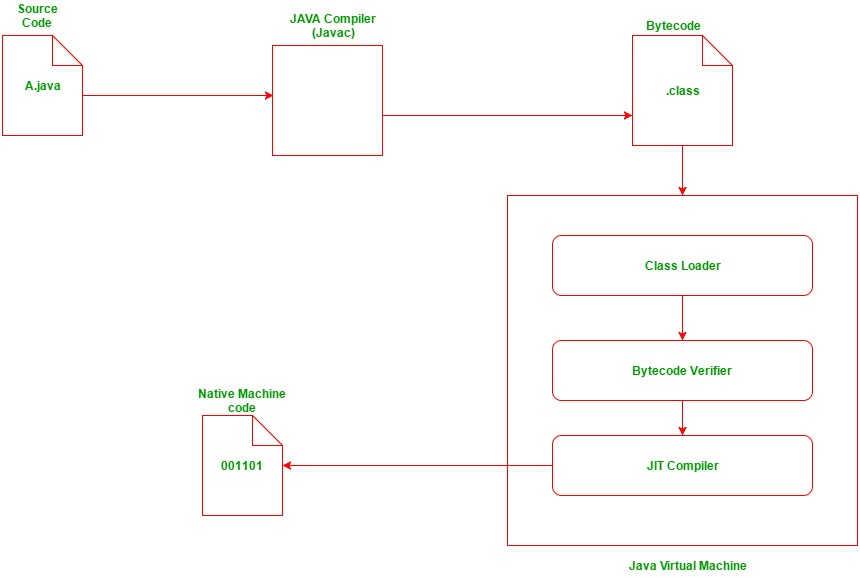

# 02

## compile
- 사전 : 엮다.
- 컴파일 이란 ? 
  - 우리가 작성한 코드들은 `컴파일` 이라는 단계를 거쳐야 프로그래밍 언어를 실행하는 프로그램이 실행을 할 수 있다.
- 컴파일 하는 방법
  - ```java
        $ javac HelloJava.java
    ```
  - 컴파일이 성공하면 `HelloJava.class` 파일이 생성된다.

## class 파일 ? 
- `*.java` 파일을 `compiler(javac)`가 읽어들여 바이트 코드로 변환한다. 이 때, `바이트 코드`로 변환하면서 생성된 파일이 `*.class` 파일이다.
- 생성된 `*.class` 파일은 **JVM(자바 가상 머신)** 이 읽을 수 있다.
   - class 파일은 `바이트 코드` 파일이기 때문에 우리가 알아볼 수 없다.
   - `intellij` or `eclipse`로 `.class` 파일을 열어서 볼 경우 디컴파일(바이트 코드를 역으로 코드로 변환)하여 우리가 알아볼 수 있게 변하기 때문에 메모장같은 에디터로 열어서 확인해 봐야함.
   - compiler에 의해 생성된 `.class` 파일은 시스템이나 OS와 독립적이므로 JVM이 있다는 가정하에 모든 시스템에서 실행할 수 있다. 

## JVM 에서의 실행

> 실행을 위해 `main method`를 포함하는 Class인 메인 Class파일이 JVM에 전달된 다음 `어셈블리 코드`가 실행되기 전에 세가지 단계를 거친다.

> `어셈블리 코드`라고 하는 것은 *.class파일은 JVM에서 한번 더 `어셈블리 코드로 번역되어` 읽혀진다.

## 3가지 주요 단계
1. Class Loader
2. Bytecode Verifier
3. Just-In-Time Compiler

### 1. **Class Loader**
- 클래스 로더는 main method를 포함한 메인 클래스를 호출하여 모든 `*.class` 파일을 `메모리에 load한다.`

### 2. Bytecode Verifier (바이트코드 검증기)
- class의 바이트코드가 클래스로더에 의해 로드되면 바이트코드 검증기에 의해 검사되어야 한다. 
- 바이트코드 검증기는 프로그램에 악영향을 끼치는 코드가 있는지 검사한다.
  - 그 중 일부를 적어보자
  - 변수는 사용되기 전에 초기화 되어야 한다.
  - 인스턴스 객체의 method를 호출할 때에 해당 객체와 Type이 일치해야 한다.
  - 지역번수 접근은 Runtime stack에 속한다.
  - Runtime stack이 overflow되지 않는다.
- 바이트코드 검증기에 의해 검증이 되지 않으면 클래스 로더가 메모리에 load하지 않는다.

### 3. Just-In-Time Compiler (JIT 컴파일러)
> Just-In-Time Compiler는 로드된 바이트코드를 `어셈블리어`로 한번 더 번역하는 역할을 한다.

- JIT 컴파일러는 Runtime시에 Java기반 Application의 성능 최적화를 담당한다.
- Java Runtime Environment (JRE) 자바 실행 환경에서 필수적이다.
- JIT 컴파일러는 바이트코드를 어셈블리어로 변환하는 과정에서 모든 바이트 코드를 매번 어셈블리어로 번역하지 않는다.
  - 메소드가 컴파일되면 JVM이 해당 메소드의 컴파일된 코드를 해석하지 않고 바로 호출한다.

### 구조

