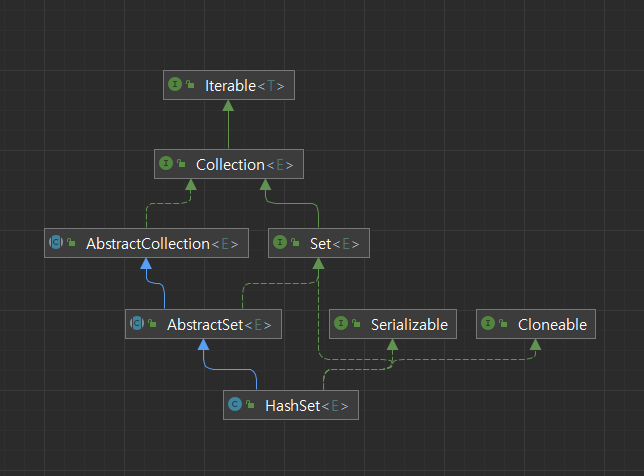
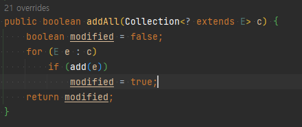

# Inherit_vs_Composition

> 상속과 조합(구성)에 대해 알아보자.
> 
> 이펙티브 자바 Item 18을 통해 학습.

## 상속의 단점

상속은 코드를 재사용 하는데 있어서 좋은 수단이지만, 일반적인 메소드 호출과 달리 캡슐화를 깨뜨릴 수 있다.

상위 클래스는 릴리스마다 내부 구현이 달라질 수 있고 그로 인해 하위 클래스의 오동작을 유발할 수 있다.

하위 클래스는 상위 클래스의 변화에 맞춰 수정 되어야 하는 일이 생긴다.

## 코드로 살펴보는 예시

```java
public class InheritSet<E> extends HashSet<E> {

   private int addCount = 0;
   
   @Override
   public boolean add(E e) {
     addCount++;
     return super.add(e);
   }
   
   @Override
   public boolean addAll(Collection<? extends E> c) {
     addCount += c.size();
     return super.addAll(c);
   }
   
   public int getAddCount() {
     return addCount;
   }
}
```

`HashSet`을 상속받은 `InhefitSet` 클래스의 객체를 사용하면서 원소가 몇 개 더해졌는지 알기 위한 `addCount` **field**를 추가하고, `add(),` `addAll()` 메소드를 사용할 때 마다 개수를 증가 시키기 위해 메소드를 재정의 하였다.

### 테스트

```java
@DisplayName("add All method를 통해 count를 4증가 시켰으니 4가 나오기를 기대한다...")
@Test
public void inheritSetTest() {

   InheritSet<String>stringInheritSet = new InheritSet<>();
   stringInheritSet.addAll(Arrays.asList("한방", "두방", "세방", "네방"));
   assertEquals(8, stringInheritSet.getAddCount());
   
   // test passed. actual 8.
}
```

이 테스트 코드를 실행하면 `getAddCount()` 메소드는 **4**를 반환할 것이라고 생각 하겠지만 **8**을 반환한다.

## 원인



`HashSet`은 위와 같은 상속 구조를 가지고 있는데, 우리가 호출하는 `addAll()` 메소드는 `AbstractCollection` 클래스의 메소드인데 `addAll()` 메소드는 `add()` 메소드를 사용하는 방식으로 구현 되어있다.



`InheritSet` 의 `addAll()` 메소드를 호출하면 `addCount`에 원소의 size인 4를 더하고 `super.addAll()`를 호출하는데, `addAll()` 메소드는 `for`문에서 재정의 한 `InheritSet` 의 `add()` 메소드를 호출하여 `addCount`는 4번 중복되어 더해져 8이라는 값을 갖게 되었다.

결국 `InheritSet`에서 재정의 한 `addAll()` 메소드는 상위 클래스의 내부 구현 방식을 모른 채 재정의 하였기 때문에 생각과는 다른 결과를 맞이하게 되었다.

## 상속의 문제점

1. 테스트 했던 케이스는 하위 클래스에서 `addAll` 메소드를 재정의 하지 않으면 문제를 고칠 수 있지만, 다음 릴리즈에서 상위 클래스의 구현 방식이 달라지면 정확한 메소드 동작을 보장할 수 없다.
2. addAll 메소드를 아예 다른 방법으로 재정의할 수 있지만, 상위 클래스의 메소드 동작을 다시 구현하는 것은 시간도 더 많이 들고, 오류를 내거나 성능을 저하시킬 수 있다.
3. 다음 릴리즈에서 상위 클래스에 **특정 원소를 모두 검증하는 과정을 거쳐 추가**하는 새로운 메소드가 추가된다면 ??
    1. 하위 클래스에서 동일한 검증하는 과정을 동일하게 구현할 수 있지만, 상위 클래스에 `add`, `addAll`이외에 또 다른 원소 추가 메소드가 생겨난다면…. 또 재정의를 해야한다.
4. 다음 릴리즈에서 하위 클래스에 추가한 메소드와 시그니처가 동일하지만 반환 타입은 다른 상위 클래스 메소드가 추가 될 수 있다.
    1. 이 경우 컴파일조차 되지 않는다..

## 상속의 문제를 피해가는 방법

상속과 관련하여 이 모든 문제를 피해가는 해결책이 있다.

기존 클래스를 확장 하는 대신에 새로운 클래스를 만들고 private필드로 **기존 클래스의 인스턴스를 참조하게 하는 설계.** **Composition(조합, 구성)**이라고 불리우는 설계 방식을 이용하면 된다.

새 클래스의 메소드들은 **private 필드로 참조하는 기존 클래스의 대응하는 메소드**를 호출해 그 결과를 반환하게 한다. 이 반식을 **전달(forwarding)** 이라고 하고 새 클래스의 메소드들을 **전달 메소드(forwarding method)**라고 부른다.

**Composition, forwarding** 방식의 이점은 이렇다.

- 기존 클래스의 내부 구현 방식의 영향에서 벗어난다.
- 기존 클래스에 새로운 메소드가 추가되더라도 전혀 영향받지 않는다.

## **Composition, forwarding 예시**

```java
// 1
public class InstrumentedSet<E> extends ForwardingSet<E> {
	
   private int addCount = 0;
   
   public InstrumentedSet(Set<E> set) {
     super(set);
   }
   
   @Override
   public boolean add(E e) {
     addCount++;
     return super.add(e);
   }
   
   @Override
   public boolean addAll(Collection<? extends E> c) {
     addCount += c.size();
     return super.addAll(c);
   }
   
   public int getAddCount() {
     return addCount;
   }
}

// 2
public class ForwardingSet<E> implements Set<E> {

   private final Set<E> set;
   
   public ForwardingSet(Set<E> set) {this.set = set;}
   @Override
   public int size() {return set.size();}
   @Override
   public boolean isEmpty() {return set.isEmpty();}
   @Override
   public boolean contains(Object o) {return set.contains(o);}
   @Override
   public Iterator<E> iterator() {return set.iterator();}
   @Override
   public Object[] toArray() {return set.toArray();}
   @Override
   public <T> T[] toArray(T[] a) {return set.toArray(a);}
   @Override
   public boolean add(E e) {return set.add(e);}
   @Override
   public boolean remove(Object o) {return set.remove(o);}
   @Override
   public boolean containsAll(Collection<?> c) {return set.containsAll(c);}
   @Override
   public boolean addAll(Collection<? extends E> c) {return set.addAll(c);}
   @Override
   public boolean retainAll(Collection<?> c) {return set.retainAll(c);}
   @Override
   public boolean removeAll(Collection<?> c) {return set.removeAll(c);}
   @Override
   public void clear() {set.clear();}
   @Override
   public boolean equals(Object o) {return set.equals(o);}
   @Override
   public int hashCode() {return set.hashCode();}
}
```

### 테스트

```java
@Test
public void compositionSetTest() {

   InstrumentedSet<String>instrumentedSet = new InstrumentedSet<>(new HashSet<>());
   instrumentedSet.addAll(Arrays.asList("한방", "두방", "세방", "네방"));
   assertEquals(4, instrumentedSet.getAddCount());
   
   // test passed. actual 4
}
```

위 테스트는 처음에 원하던 결과인 4를 얻게된다.

새로 만든 `InstrumentedSet` 클래스는 `ForwardingSet`클래스를 확장하여 `add`와 `addAll`메소드는 `ForwardingSet`의 메소드를 이용하게 되는데, `ForwardingSet`은 Set 인터페이스를 구현한 구현 클래스 이다.

테스트 코드에서 `ForwardingSet` 클래스는 생성자로 주입받은 `HashSet`을 **private final 필드로 참조**하게 되는데 이것을 **Composition**이라고 할 수 있다.

`ForwardingSet` 클래스는 Set 인터페이스의 모든 메소드를 재정의 하고 있는데, 재정의 내용은 간단하다. 기존 `Set` 인터페이스 메소드의 결과를 그냥 반환할 뿐이다. 이 메소드들은 **전달 메소드이다.**

결국 새로 만든 `InstrumentedSet` 클래스는 `addCount`에 숫자를 증가 시키는 **기능의 확장**을 일궈내면서 **상위 클래스에 기능변경에 영향을 받지 않으며**, `Forwarding` 클래스의 **전달 메소드**를 통해 기존 클래스`(HashSet)`의 똑같은 기능을 그대로 사용할 수 있게 되었다.

`InstrumentedSet` 클래스는 `HashSet`의 모든 기능은 정의한 `Set` 인터페이스를 활용해 설계되어 견고하면서도 유연한 클래스가 되었다.

위 구조는 `Set`의 **기능을 덧씌워** 새로운 `Set`으로 만들었기 때문에 `HashSet, TreeSet`등 다양한 `Set`구현체를 사용할 수 있다.

하지만, 상속 방식은 `HashSet`과 같이 구체적인 구현체에 해당하는 클래스를 각각 따로 확장하여 구현해야 한다는 점에서도 이점을 가진다.

(만약 상속으로 구현한다면 `TreeSet, HashSet` 을 직접 재정의 하므로써 달라지는 구현 내용에 대해 고민해야함.)

`InstrumentedSet`  클래스를 통한 용어 설명

- 다른 Set에 기능을 덧씌운다는 뜻에서 **데코레이터 패턴 (Decorator pattern)** 이라고 한다.
- 다른 Set 인스턴스를 감싸고 있다는 뜻에서 `InstrumentedSet` 같은 클래스를 **래퍼 클래스 (Wrapper)** 라고 한다.
- **Composition과 Forwarding 조합**은 넓은 의미로 **위임 (delegation)** 이라고 부른다.

상속대신 **컴포지션과 전달의 조합**으로 상속의 문제점을 타파하면서도 코드 재사용성, 기능 확장에 대한 이점은 그대로 가져갈 수 있다.

## 정리

상속은 반드시 하위 클래스가 상위 클래스의 진짜 하위 타입인 상황에서만 쓰여야 한다.

다르게 말하면 클래스 B가 클래스 A와 **순수한 is-a** **관계**일 때만 클래스 A를 상속해야 한다.

클래스 A를 상속하는 클래스 B를 작성하려 한다면 **“B가 정말 A인가 ?”** 생각해보자.

**“그렇다”** 고 확신할 수 없다면 B는 A를 상속(확장)해서는 안된다.

대답이 **“아니다”** 라면 A를 private 인스턴스로 두고, A와 다른 API를 제공해야 하는 상황이 대다수다.

즉, A는 B의 필수 구성요소가 아니라 구현 방법중에 하나일 뿐이다.

컴포지션 대신에 상속을 사용하기로 결정하기 전에 마지막으로 자문해야 할 질문이 있다.

**“확장하려는 클래스의 API에 아무런 결함이 없는가 ?”** 결함이 있다면 **“이 결함이 하위 클래스 까지 전파돼도 괜찮은가 ?”**

컴포지션으로는 이런 결함을 숨기는 새로운 API를 설계할 수 있지만, **상속은 상위 클래스의 API를 ‘그 결함 까지도’ 그대로 승계한다.**

**상속의 취약점을 피하려면 상속 대신 컴포지션과 전달을 사용하자. 특히 래퍼 클래스로 구현할 적당한 인터페이스(Set 같은)가 있다면 더욱 그렇다. 래퍼 클래스는 하위 클래스보다 견고하고 강력하다 !**